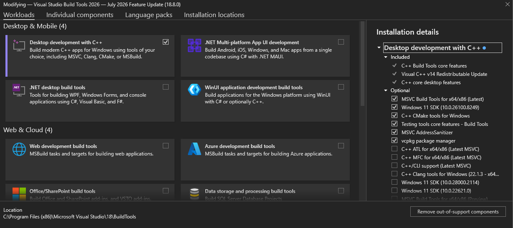
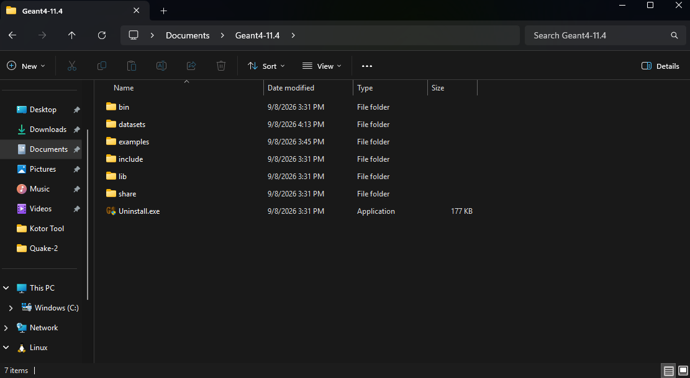
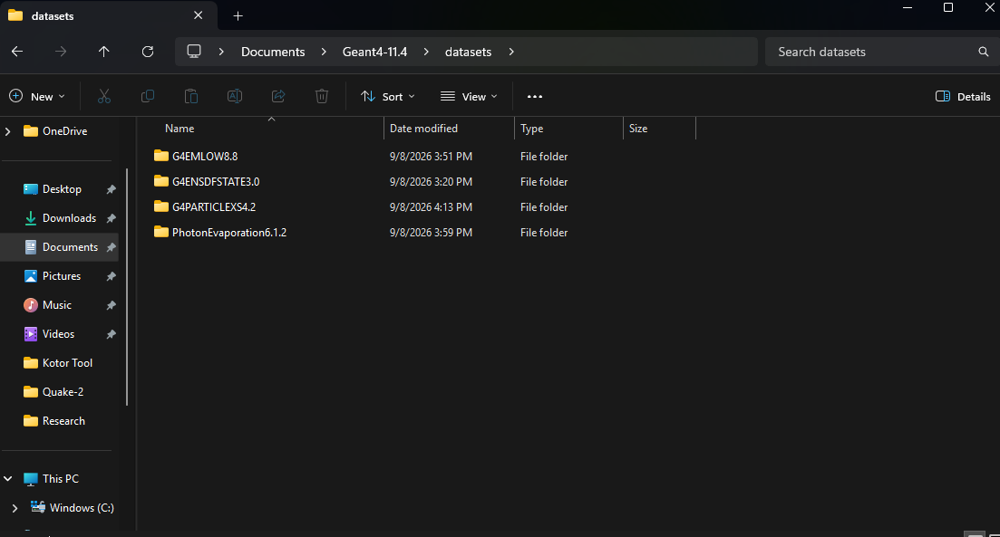
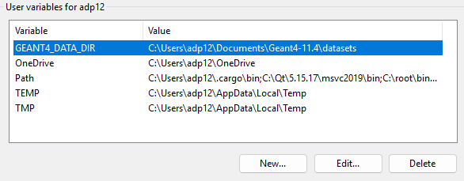
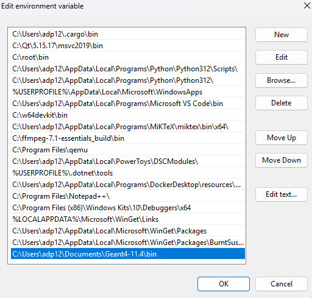
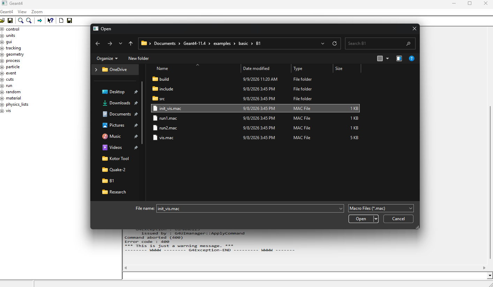

Hi, this is my guide to installing GEANT4 on Windows. Many guides have you build from the raw source code, but to make things easier we're going to do it via the precompiled Windows binaries that CERN so graciously provides us (this level of charity towards Windows users is unprecedented).

This guide holds your hand, no offense if you're actually a C++ and Windows expert.

### Requirements

- [Visual Studio Build Tools](https://aka.ms/vs/stable/vs_BuildTools.exe) - Microsoft's C/C++ compiler
- [GEANT4 installer](https://cern.ch/geant4-data/releases/lib4.11.4.p02/WIN64-VC17.11.4-11.exe)
- [GEANT4 Datasets](https://geant4.web.cern.ch/download/11.4.2.html)
- [GEANT4 source](https://gitlab.cern.ch/geant4/geant4/-/archive/v11.4.2/geant4-v11.4.2.zip) - For code examples

### Installing BuildTools

Install `vs_BuildTools.exe` from [Visual Studio Build Tools](https://aka.ms/vs/stable/vs_BuildTools.exe) and run it. Select "Desktop development with C++" and make sure you have the same boxes ticked as I do.




Then click "Install".

### Installing GEANT4

Run the GEANT4 installer you got from [GEANT4 installer](https://cern.ch/geant4-data/releases/lib4.11.4.p02/WIN64-VC17.11.4-11.exe). By default, it likes to install to `C:\Program Files`. The Program Files folder always requires admin approval to make changes to, so I'd advise to install it to a different location. I installed it to my Documents folder in `C:\Users\YOURUSERNAME\Documents\Geant4-11.4`. 

After installation, here is what `C:\Users\YOURUSERNAME\Documents\Geant4-11.4` should look like (ignore the `datasets` and `examples` folders):





Now, drag and drop the `examples` folder from the [GEANT4 source code](https://gitlab.cern.ch/geant4/geant4/-/archive/v11.4.2/geant4-v11.4.2.zip) into this folder. Now, make a folder called `datasets`. The GEANT4 datasets are found on [this page](https://geant4.web.cern.ch/download/11.4.2.html) at the bottom. Move the folder from the compressed dataset archive into the `datasets` folder you created. This is how mine looks:





### Setting up Environment Variables

In the `bin/` folder of your GEANT4 installation are a bunch of .dll files that contain functions you will need to use. Windows needs to know where these .dlls are so they can be loaded at runtime. We can tell Windows where the .dlls are located by setting an **environment variable**. Here we can also tell Windows where the datasets are located.

In the Start Menu, search for "edit the system environment variables". Click the result. On the bottom right, click "Environment variables". Create a new environment variable with the name `GEANT4_DATA_DIR` and set the value to the location of the `datasets` folder. Here is what mine looks like:




Now that Windows knows where the datasets are, we need to tell it where the .dlls are. Click the `Path` variable, then click `Edit`.  Click "New", and paste the filepath to the `bin` folder. Here is how mine looks:




Hit "OK" to finish and make sure to click "Apply" before "OK" in the first window you opened (it says "System Properties" on the top tab).

### Compiling example B1

Alright, your GEANT4 installation should be operational now! Let's do a quick test to see if everything is working. 

**Side note**: GEANT4 isn't your usual program. Notice how the installation didn't drop an .exe file anywhere for you to run. GEANT4 provides you a platform to build your own simulation programs from. As such, each simulation has its own `.exe` file. You can explore the code in the examples to see how they're made/structured. 

Lets try compiling an example program to verify everything works. In the Start Menu, search for `x64 Native Tools Command Prompt for VS` and open it. This is a command prompt that includes the C++ compiler and CMake. Move into the example B1 folder via 

```
cd C:\Users\YOURUSER\Documents\Geant4-11.4\examples\basic\B1
```

In this folder, make a new folder and move into it via these commands:

```
mkdir build
cd build
```

Now we need to use CMake to build the example. Run the following commands:

```
cmake ..
cmake --build . --config Release
```

If all went well, you should have `Release/exampleB1.exe` in the `build` folder. To run the program, execute

```
cd Release
exampleB1.exe
```

A window should've opened! This is a good sign. Now, we want to initialize visualization. Click the "Open" button (the open folder) and navigate to the B1 folder. Open `init_vis.mac`. Here is what mine looks like:




GEANT will do a bunch of things (it might go "not responding" for a bit, just give it time). Once it finishes, you should see that it opened another window with the detector in view. In the same way, open `run1.mac` to simulate some events. You should now see particle tracks in the visualization window. 

You can also type in `/run/beamOn 10` in the command line at the bottom of the window to simulate 10 events.

If you got to this point without any problems, **you're done!**


### Helpful links

- [GEANT4 YouTube Tutorials](https://www.youtube.com/playlist?list=PLLybgCU6QCGWgzNYOV0SKen9vqg4KXeVL) - This guy has tutorials for constructing a detector, creating the physics list, and everything else you'll need to do to create your own custom detector simulation.


